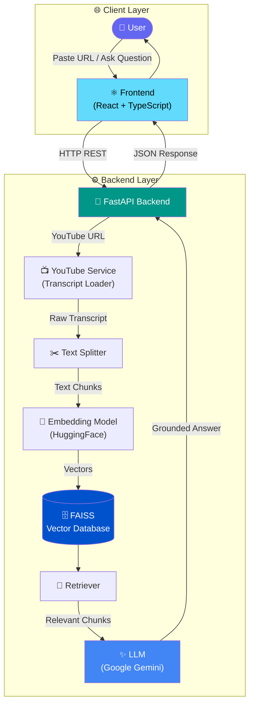
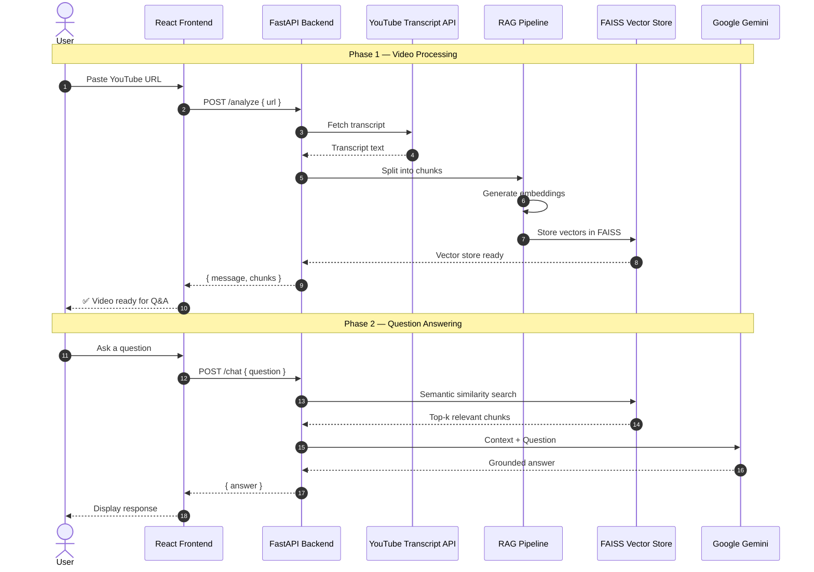

<div align="center">

# 🎬 TubeRAG

### AI-Powered YouTube Question Answering with Retrieval-Augmented Generation

Ask natural language questions about any YouTube video and get **accurate, context-grounded answers** powered by RAG.

<br />

[](https://www.python.org/)
[](https://fastapi.tiangolo.com/)
[](https://react.dev/)
[](https://www.langchain.com/)
[](https://github.com/facebookresearch/faiss)
[](https://www.docker.com/)
[](https://opensource.org/licenses/MIT)

[Features](#-features) •
[Architecture](#-architecture) •
[Quick Start](#-installation) •
[API Reference](#-api-endpoints) •
[Docker](#-docker) •
[Contributing](#-future-improvements)

</div>

---

## ✨ Features

| | Feature | Description |
|---|---|---|
| 🎥 | **YouTube Video Q&A** | Paste any YouTube URL and ask questions about its content |
| 🤖 | **AI-Powered RAG Chatbot** | Retrieval-Augmented Generation ensures answers stay grounded in the video |
| 📝 | **Transcript Extraction** | Automatically fetches and processes YouTube video transcripts |
| 🔍 | **Semantic Search** | Vector embeddings enable meaning-based chunk retrieval |
| 💬 | **Context-Aware Responses** | LLM answers only from retrieved transcript context |
| ⚡ | **FastAPI Backend** | High-performance async REST API with automatic OpenAPI docs |
| 🔌 | **REST APIs** | Clean, well-structured endpoints for frontend integration |
| 🐳 | **Docker Support** | Containerized deployment for consistent environments |
| 🧩 | **Modular Architecture** | Separated routes, services, and RAG pipeline components |

---

## 🏗 Architecture

### System Overview



### API Sequence Flow



---

## 🔄 High-Level Workflow

<details open>
<summary><strong>Click to expand workflow steps</strong></summary>

<br />

| Step | Action | Component |
|:----:|--------|-----------|
| **1** | User pastes a YouTube video URL on the frontend | React UI |
| **2** | Backend extracts the video transcript via YouTube Transcript API | `youtube_service.py` |
| **3** | Transcript is split into overlapping text chunks | `RecursiveCharacterTextSplitter` |
| **4** | Each chunk is converted into a dense vector embedding | HuggingFace `all-MiniLM-L6-v2` |
| **5** | Embeddings are stored in a FAISS index (persisted per video) | `vector_db/{video_id}/` |
| **6** | User asks a natural language question in the chat interface | React Chat UI |
| **7** | Retriever fetches the top-k most semantically relevant chunks | FAISS Retriever (`k=3`) |
| **8** | LLM generates a grounded response using retrieved context only | Google Gemini 2.5 Flash |
| **9** | Response is returned to the frontend and displayed to the user | REST API → React |

</details>

---

## 🛠 Tech Stack

<table>
<tr>
<th>Layer</th>
<th>Technology</th>
<th>Purpose</th>
</tr>
<tr>
<td rowspan="3"><strong>Frontend</strong></td>
<td></td>
<td>Component-based UI</td>
</tr>
<tr>
<td></td>
<td>Type-safe JavaScript</td>
</tr>
<tr>
<td></td>
<td>Utility-first styling</td>
</tr>
<tr>
<td rowspan="3"><strong>Backend</strong></td>
<td></td>
<td>REST API framework</td>
</tr>
<tr>
<td></td>
<td>ASGI server</td>
</tr>
<tr>
<td></td>
<td>Backend runtime</td>
</tr>
<tr>
<td rowspan="3"><strong>AI / LLM</strong></td>
<td></td>
<td>RAG orchestration</td>
</tr>
<tr>
<td></td>
<td>Large Language Model</td>
</tr>
<tr>
<td></td>
<td>Sentence-transformer embeddings</td>
</tr>
<tr>
<td><strong>Vector Store</strong></td>
<td></td>
<td>Similarity search & indexing</td>
</tr>
<tr>
<td><strong>Database</strong></td>
<td><em>Local FAISS index files</em></td>
<td>Persistent vector storage per video (<code>vector_db/</code>)</td>
</tr>
<tr>
<td><strong>Deployment</strong></td>
<td></td>
<td>Containerized deployment</td>
</tr>
<tr>
<td><strong>Version Control</strong></td>
<td> </td>
<td>Source control & collaboration</td>
</tr>
</table>

---

## 📁 Project Structure

```
TubeRAG/
│
├── frontend/                          # React + TypeScript frontend
│   ├── public/
│   ├── src/
│   │   ├── components/
│   │   │   ├── chat/                  # Chat UI components
│   │   │   │   ├── ChatHeader.tsx
│   │   │   │   ├── ChatInput.tsx
│   │   │   │   ├── ChatMessages.tsx
│   │   │   │   └── MessageBubble.tsx
│   │   │   └── common/                # Shared layout components
│   │   │       ├── Navbar.tsx
│   │   │       ├── Hero.tsx
│   │   │       ├── Features.tsx
│   │   │       └── About.tsx
│   │   ├── pages/
│   │   │   ├── Home/                  # Landing page
│   │   │   └── Chat/                  # Q&A chat interface
│   │   ├── services/
│   │   │   └── api.ts                 # Backend API client
│   │   ├── App.tsx
│   │   └── main.tsx
│   ├── package.json
│   └── vite.config.ts
│
├── backend/                           # FastAPI backend
│   ├── app/
│   │   ├── main.py                    # Application entry point
│   │   ├── routes/
│   │   │   ├── youtube.py             # Video analysis endpoint
│   │   │   └── chat.py                # Chat Q&A endpoint
│   │   ├── rag/
│   │   │   ├── chain.py               # RAG chain orchestration
│   │   │   ├── embeddings.py          # HuggingFace embedding model
│   │   │   ├── llm.py                 # Google Gemini LLM
│   │   │   ├── retriever.py           # FAISS retriever config
│   │   │   ├── splitter.py            # Text chunking logic
│   │   │   └── vector_store.py        # FAISS index management
│   │   ├── services/
│   │   │   └── youtube_service.py     # Transcript extraction
│   │   └── utils/
│   │       └── store.py               # Global RAG chain state
│   ├── vector_db/                     # Persisted FAISS indexes (auto-generated)
│   ├── requirements.txt
│   ├── Dockerfile
│   └── .env.example
│
└── README.md
```

---

## 📡 API Endpoints

> **Interactive docs:** Once the backend is running, visit [http://localhost:8000/docs](http://localhost:8000/docs) for Swagger UI.

### Overview

| Method | Endpoint | Description |
|:------:|----------|-------------|
| `GET` | `/` | Root — confirms backend is running |
| `GET` | `/health` | Health check for monitoring |
| `POST` | `/analyze` | Process a YouTube URL and build the RAG pipeline |
| `POST` | `/chat` | Ask a question about the analyzed video |

---

### `GET /`

Returns a welcome message confirming the backend is operational.

**Response `200 OK`**

```json
{
  "message": "TubeRAG Backend is Running 🚀"
}
```

---

### `GET /health`

Lightweight health check endpoint for load balancers and monitoring.

**Response `200 OK`**

```json
{
  "status": "healthy"
}
```

---

### `POST /analyze`

Extracts the transcript from a YouTube video, chunks it, generates embeddings, and stores them in FAISS.

**Request Body**

```json
{
  "url": "https://www.youtube.com/watch?v=dQw4w9WgXcQ"
}
```

| Field | Type | Required | Description |
|-------|------|:--------:|-------------|
| `url` | `string` | ✅ | Full YouTube video URL |

**Response `200 OK`**

```json
{
  "message": "Video analyzed successfully",
  "chunks": 42
}
```

| Field | Type | Description |
|-------|------|-------------|
| `message` | `string` | Status message |
| `chunks` | `integer` | Number of text chunks created from the transcript |

---

### `POST /chat`

Sends a question to the RAG pipeline and returns a context-grounded answer.

**Request Body**

```json
{
  "question": "What is the main topic discussed in this video?"
}
```

| Field | Type | Required | Description |
|-------|------|:--------:|-------------|
| `question` | `string` | ✅ | Natural language question about the video |

**Response `200 OK`**

```json
{
  "answer": "The main topic discussed in this video is..."
}
```

**Response — No video analyzed**

```json
{
  "error": "Please analyze a video first."
}
```

---

## 🔐 Environment Variables

Copy the example file and fill in your API keys:

```bash
cp backend/.env.example backend/.env
```

| Variable | Required | Description | Example |
|----------|:--------:|-------------|---------|
| `GEMINI_API_KEY` | ✅ | Google Gemini API key for LLM responses | `AIzaSy...` |
| `GROQ_API_KEY` | ❌ | Groq API key *(optional — for future LLM provider support)* | `gsk_...` |
| `HF_TOKEN` | ❌ | HuggingFace token *(optional — for gated models)* | `hf_...` |
| `MODEL_NAME` | ❌ | Override default LLM model name *(optional)* | `gemini-2.5-flash` |

<details>
<summary><strong>How to get API keys</strong></summary>

<br />

- **Google Gemini:** [Google AI Studio](https://aistudio.google.com/app/apikey) → Create API Key
- **Groq:** [Groq Console](https://console.groq.com/keys) → Create API Key
- **HuggingFace:** [HuggingFace Settings](https://huggingface.co/settings/tokens) → New Token

</details>

---

## 🚀 Installation

### Prerequisites

- **Python** 3.10+
- **Node.js** 18+
- **npm** or **yarn**
- A **Google Gemini API key**

---

### 1️⃣ Clone the Repository

```bash
git clone https://github.com/your-username/TubeRAG.git
cd TubeRAG
```

---

### 2️⃣ Backend Setup

```bash
cd backend

# Create and activate virtual environment
python -m venv venv

# Windows
venv\Scripts\activate

# macOS / Linux
source venv/bin/activate

# Install dependencies
pip install -r requirements.txt

# Configure environment variables
cp .env.example .env
# Edit .env and add your GEMINI_API_KEY

# Start the FastAPI server
uvicorn app.main:app --reload --host 0.0.0.0 --port 8000
```

✅ Backend running at **http://localhost:8000**

---

### 3️⃣ Frontend Setup

Open a new terminal:

```bash
cd frontend

# Install dependencies
npm install

# Start the development server
npm run dev
```

✅ Frontend running at **http://localhost:5173**

---

## 🐳 Docker

Run the entire stack with Docker for a consistent, reproducible environment.

### Build Images

```bash
# Build backend image
docker build -t tuberag-backend ./backend

# Build frontend image
docker build -t tuberag-frontend ./frontend
```

### Run Containers

```bash
# Run backend (pass your API key)
docker run -d \
  --name tuberag-api \
  -p 8000:8000 \
  -e GEMINI_API_KEY=your_api_key_here \
  tuberag-backend

# Run frontend
docker run -d \
  --name tuberag-ui \
  -p 5173:5173 \
  tuberag-frontend
```

### Docker Compose *(recommended)*

```bash
# From project root
docker compose up --build
```

<details>
<summary><strong>Example <code>docker-compose.yml</code></strong></summary>

```yaml
services:
  backend:
    build: ./backend
    ports:
      - "8000:8000"
    env_file:
      - ./backend/.env
    volumes:
      - ./backend/vector_db:/app/vector_db

  frontend:
    build: ./frontend
    ports:
      - "5173:5173"
    depends_on:
      - backend
```

</details>

---

## 📸 Application Screenshots

> Replace the placeholder paths below with your actual screenshots once captured.

### Home Page


*Landing page with YouTube URL input and feature highlights.*

---

### Chat Interface


*Interactive Q&A chat powered by RAG.*

---

### Processing Video


*Transcript extraction and embedding pipeline in progress.*

---

### Answer Generation


*Context-grounded AI response based on video content.*

---

## 🔮 Future Improvements

- [ ] **Multi-video support** — Analyze and query across multiple videos in one session
- [ ] **PDF upload** — Extend RAG pipeline to support PDF documents
- [ ] **Audio upload** — Transcribe and query uploaded audio files
- [ ] **User authentication** — Secure per-user sessions and API access
- [ ] **Chat history** — Persist conversation history across sessions
- [ ] **Cloud deployment** — Deploy to AWS / GCP / Azure with CI/CD
- [ ] **Streaming responses** — Server-sent events for real-time answer streaming
- [ ] **Multiple LLM providers** — Switch between Gemini, Groq, and OpenAI
- [ ] **Source citations** — Show timestamp-linked references in answers

---

## 📄 License

This project is licensed under the **MIT License** — see the [LICENSE](LICENSE) file for details.

```
MIT License

Copyright (c) 2025 TubeRAG

Permission is hereby granted, free of charge, to any person obtaining a copy
of this software and associated documentation files (the "Software"), to deal
in the Software without restriction, including without limitation the rights
to use, copy, modify, merge, publish, distribute, sublicense, and/or sell
copies of the Software, and to permit persons to whom the Software is
furnished to do so, subject to the following conditions:

The above copyright notice and this permission notice shall be included in all
copies or substantial portions of the Software.

THE SOFTWARE IS PROVIDED "AS IS", WITHOUT WARRANTY OF ANY KIND, EXPRESS OR
IMPLIED, INCLUDING BUT NOT LIMITED TO THE WARRANTIES OF MERCHANTABILITY,
FITNESS FOR A PARTICULAR PURPOSE AND NONINFRINGEMENT.
```

---

## 👤 Author

<div align="center">

**CHINMAYA**

Full-Stack Developer · AI/ML Enthusiast · Open Source Contributor

<br />

[](https://github.com/your-username)
[](https://linkedin.com/in/your-profile)
[](https://your-portfolio.com)

<br />

⭐ **If you found this project helpful, please consider giving it a star!**

</div>

---

<div align="center">

Built with ❤️ using **FastAPI**, **LangChain**, **FAISS**, and **React**

</div>
