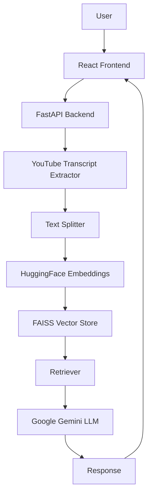

# TubeRAG

TubeRAG is an AI-powered YouTube Question Answering application built with Retrieval-Augmented Generation (RAG).
Paste a YouTube URL, ask a question, and get context-aware answers grounded in the video's transcript — no hallucinations, just relevant responses.

---

## Features

- 🎯 AI-powered Q&A directly from YouTube videos
- 🔍 Semantic search with FAISS vector store
- 📄 Automatic transcript extraction & chunking
- 🧠 Context-aware responses via Google Gemini
- ⚡ FastAPI backend with React frontend
- 🐳 Docker support for easy deployment

---

## Tech Stack

| Layer | Technology |
|---|---|
| **Frontend** | React, TypeScript, Tailwind CSS |
| **Backend** | FastAPI, Python |
| **AI / LLM** | LangChain, Google Gemini |
| **Embeddings** | HuggingFace Sentence Transformers |
| **Vector Store** | FAISS |
| **Deployment** | Docker |

---

## Architecture



---

## Project Structure

```
TubeRAG/
├── app/
│   ├── main.py          # FastAPI entry point
│   ├── rag_pipeline.py  # RAG logic (embed, retrieve, generate)
│   └── utils.py         # Transcript extraction helpers
├── frontend/
│   ├── src/
│   │   ├── App.tsx
│   │   └── components/
│   └── package.json
├── docker-compose.yml
└── requirements.txt
```

---

## Getting Started

**Backend**

```bash
git clone https://github.com/your-username/TubeRAG.git
cd TubeRAG

pip install -r requirements.txt
uvicorn app.main:app --reload
```

**Frontend**

```bash
cd frontend
npm install
npm run dev
```

> The backend runs on `http://localhost:8000` and the frontend on `http://localhost:5173` by default.

---

## Future Improvements

- Multi-turn chat history
- Support for multiple videos simultaneously
- User authentication & saved sessions
- Cloud deployment (Render / Railway / Vercel)

---

## Author

**Name:** Chinmaya  
**GitHub:** [github.com/chinmaya-03](https://github.com/chinmaya-03)  
**LinkedIn:** [linkedin.com/in/chinmaya-m-831572251](https://www.linkedin.com/in/chinmaya-m-831572251/)
